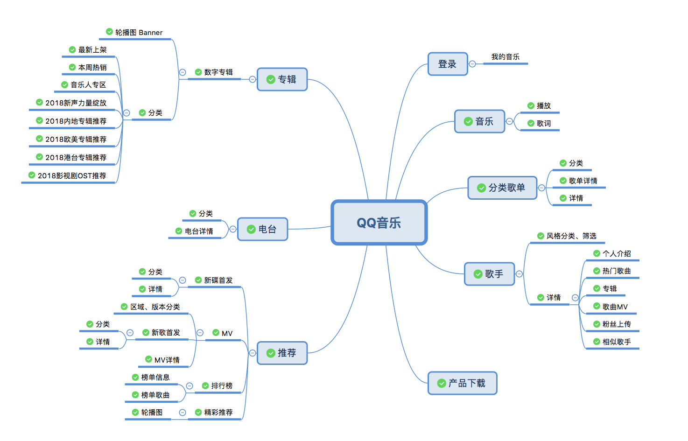

<h1 align="center">QQ Music API</h1>

<div align="center">


  
<br />

<br />
      

</div>

> 🍴 本项目 Fork 自 [Rain120/qq-music-api](https://github.com/Rain120/qq-music-api)，原项目已停止维护，此版本持续更新中

> QQ音乐API koa2 版本, 通过Web网页版请求QQ音乐接口数据, 有问题请提 [issue](https://github.com/sansenjian/qq-music-api/issues)

> 当前代码仅供学习，不可做商业用途

### API结构图

> 目前暂时没有时间做登录模块的接口，欢迎各位大佬给我`PR`, 阿里嘎多



### 环境要求

> 本项目采用 `koa2`，需要 Node.js 18.0.0+

```
node -v
```

### 📦 安装

**方式一：克隆仓库**
```
git clone git@github.com:sansenjian/qq-music-api.git
cd qq-music-api
npm install
```

**方式二：NPM 安装**
```
npm install @sansenjian/qq-music-api
```

在项目中使用：
```javascript
// 启动 API 服务
const { spawn } = require('child_process');
const path = require('path');

const qqMusicPath = path.join(__dirname, 'node_modules', '@sansenjian/qq-music-api', 'app.js');
spawn('node', [qqMusicPath], { 
  env: { ...process.env, PORT: '3200' },
  stdio: 'inherit'
});
```

### 🔨 项目启动
```
// npm i -g nodemon
npm run start

// or don't install nodemon
node app.js
```
项目监听端口是 `3200`

### 📋 依赖更新 (2026-03)

本项目已完成依赖现代化升级，主要变更如下：

**生产依赖**
| 依赖 | 版本 | 说明 |
|-----|------|-----|
| axios | ^1.6.0 | 修复安全漏洞 CVE-2021-3749 |
| koa | ^2.15.0 | 框架更新 |
| koa-bodyparser | ^4.4.0 | 解析器更新 |
| @koa/router | ^12.0.0 | 替代 koa-router |
| koa-static | ^5.0.0 | 静态文件服务 |
| dayjs | ^1.11.10 | 替代 moment.js (更轻量) |

**开发依赖**
| 依赖 | 版本 | 说明 |
|-----|------|-----|
| eslint | ^8.56.0 | 代码检查 |
| eslint-config-standard | ^17.0.0 | 标准配置 |
| prettier | ^3.0.0 | 代码格式化 |
| husky | ^9.0.0 | Git 钩子 |
| lint-staged | ^15.0.0 | 暂存区检查 |
| @commitlint/* | ^18.0.0 | 提交信息规范 |
| @babel/* | ^7.23.0 | 编译工具 |
| nodemon | ^3.0.0 | 开发热重载 |

**已移除的依赖**
- `colors` - 存在安全问题，已用 chalk 替代
- `moment` - 已用 dayjs 替代
- `lodash.get` - 已用原生可选链 `?.` 替代
- `eslint-plugin-node` - 已用 eslint-plugin-n 替代
- `eslint-plugin-standard` - 已集成到 eslint-config-standard

### 功能特性

- [x] 获取歌曲播放链接 **2021-01-24**

- [x] 支持自定义设置 `cookie` **2021-01-23**

- [x] 获取歌曲 + 专辑图片 **2020-05-24**

- [x] 获取歌手热门歌曲 **2020-07-04**

- [x] 获取QQ音乐产品的下载地址

- [x] 获取歌单分类

- [x] 获取歌单列表

- [x] 获取歌单详情

- [x] 获取MV标签

- [x] 获取MV播放信息

- [x] 获取歌手MV

- [x] 获取相似歌手

- [x] 获取歌手信息

- [x] 获取歌手被关注数量信息

- [x] 获取电台列表

- [x] 获取专辑

- [x] 获取数字专辑

- [x] 获取歌曲歌词

- [x] 获取MV

- [x] 获取新碟信息

- [x] 获取歌手专辑

- [x] ~~获取歌曲VKey~~ **2021-01-24**

- [x] 获取搜索热词

- [x] 获取关键字搜索提示

- [x] 获取搜索结果

- [x] 获取首页推荐

- [x] 获取排行榜单列表

- [x] 获取排行榜单详情

- [x] 获取评论信息(cmd代表的意思没太弄明白)

- [x] 获取票务信息

- [x] 获取歌单详情

- [x] 获取歌手列表

### 使用文档

使用`apis`详见[文档](https://rain120.github.io/qq-music-api/#/)

### 关于项目

**灵感来自**

[Binaryify/NeteaseCloudMusicApi](https://github.com/Binaryify/NeteaseCloudMusicApi)

[Vue2.0开发企业级移动端音乐Web App](https://coding.imooc.com/class/107.html)

**参考内容**

[Koa 2](https://koa.bootcss.com/)

[Axios](https://github.com/axios/axios)

[阮一峰老师 - HTTP Referer 教程](http://www.ruanyifeng.com/blog/2019/06/http-referer.html)

### 项目不足

1. 因为本人没写过`unit test`, 所以本项目尚未添加`unit test`, 等有时间再添加;

2. 登录获取个人信息等接口都没做

#### 🤝 贡献 

We welcome all contributions. You can submit any ideas as [pull requests](https://github.com/sansenjian/qq-music-api/pulls) or as a GitHub [issue](https://github.com/sansenjian/qq-music-api/issues). 

#### 👨‍🏭 维护者

- [GitHub](https://github.com/sansenjian)

#### 🙏 原作者

本项目基于 [Rain120](https://github.com/Rain120) 的开源项目，感谢原作者的贡献！

- [GitHub](https://github.com/Rain120)
- [知乎](https://www.zhihu.com/people/yan-yang-nian-hua-120/activities)
- [掘金](https://juejin.im/user/57c616496be3ff00584f54db)

#### 📝 License

[MIT](https://github.com/sansenjian/qq-music-api/blob/master/LICENSE)

Copyright © 2019-present [Rain120](https://github.com/Rain120).  
Fork maintained by [sansenjian](https://github.com/sansenjian).
